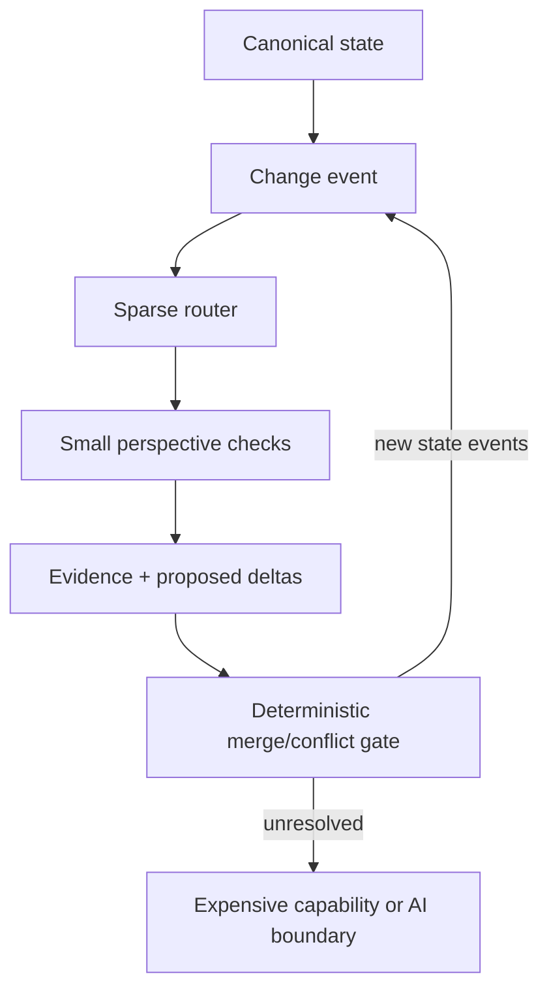

# AXM State Research

> Our research into the chain from state to output by readjusting nodes—or anything currently unknown—to find the limits and memory-reduction potential.

This repository is the canonical public research home for AXM experiments around deterministic state, sparse specialist routing, perspective fabrics, replay, evidence-preserving merge rules, and the boundary between cheap deterministic work and expensive reasoning.

The experiments are built to discover failure, not protect an idea. Raw results, failed variants, repaired variants, receipts, claim boundaries, and limitations remain attached.

## Current verified chain



## Experiments

| Experiment | Core question | Verified result |
|---|---|---|
| [01 — AXM State Floor](experiments/01-state-floor/) | Can 10,000 registered perspective variants coexist while only relevant nodes wake? | 10,000 registered; 159 triggered; 9 changed state; deterministic replay and baseline output equivalence passed. |
| [02 — AXM Workfloor Sentinel](experiments/02-workfloor-sentinel/) | Can sparse routing avoid leaving a necessary real-project check asleep? | A planted dependency omission caused one genuine miss; the repaired map reached zero misses across seven controlled changes, with 61% false wake-ups still exposed. |
| [03 — AXM Wakeup Fuzzer](experiments/03-wakeup-fuzzer/) | Is positive activation cheaper than polling every registered check, and can a missing edge be minimized? | At 10,000 mutations, declared sparse was 6.45× faster than polling on one host; one omission caused 64 wrong transitions and minimized to one mutation. |
| [04 — AXM Adaptive Closure Verifier](experiments/04-adaptive-closure-verifier/) | Can sparse routing audit and repair activation and state-slice closure failures? | The broken control failed; audited policies repaired/replayed to equality with damage windows from 0 to 131 transitions in the controlled fixture. |
| [05 — AXM Real-Project Closure Trial](experiments/05-real-project-closure-trial/) | Does train/freeze closure survive held-out mutations over Sentinel's 242 canonical checks? | Combined risk+observed left zero silent stale outputs and used 110 audit+replay checks versus 1,452 full-oracle checks; broken and observed-only failures were retained and minimized. |
| [06 — Unlabeled Multi-Project Closure](experiments/06-unlabeled-multiproject-closure-challenge/) | Does frozen closure transfer from one canonical project to two unlabeled held-out project versions with checkpoint faults? | Combined structural+observed left zero silent stale outputs and used 597 total policy checks versus 1,955 full-oracle checks; absent/corrupt checkpoints were quarantined and reconstructed with charged work. |
| [07 — Stateborn RPG Lab](experiments/07-stateborn-rpg-lab/) | Can state-first game mechanisms evolve through sparse relations, outcome-blind curiosity, bounded coexistence, typed coordination, and hostile delivery? | v0.1–v0.7 are preserved. The latest frozen gate passed 97 tests: 7 transport routes solved, 1 refused, and 2 deadlocked while preserving consent, privacy, sources, and exact replay. |

See the [Research Index](docs/RESEARCH_INDEX.md) for exact metrics, the [State Research Map](docs/STATE_RESEARCH_MAP.md) for the hypothesis tree, and [Claim Boundaries](docs/CLAIM_BOUNDARIES.md) for what has not been established.

## Run the evidence

Experiments 01–06 require Python 3.11 or newer and use only the standard library. Experiment 07 requires Node.js 20 or newer and has no runtime package dependency.

```bash
cd experiments/01-state-floor
python3 -m unittest discover -s tests -v

cd ../02-workfloor-sentinel
python3 -m unittest discover -s tests -v

cd ../03-wakeup-fuzzer
python3 -m unittest discover -s tests -v

cd ../04-adaptive-closure-verifier
python3 -m unittest discover -s tests -v

cd ../05-real-project-closure-trial
python3 -m unittest discover -s tests -v

cd ../06-unlabeled-multiproject-closure-challenge
python3 -m unittest discover -s tests -v

cd ../07-stateborn-rpg-lab
npm test
node tools/validate-static.mjs
node tools/capsule-probe.mjs
node tools/state-language-probe.mjs
node tools/state-transport-probe.mjs
```

## Collaboration rule

**One AI chat instance gets one PR lane.** A lane means one branch and one pull request for that chat's bounded work. Do not scatter one chat across multiple PRs or push into another chat's branch. Full rules are in [AGENTS.md](AGENTS.md).

## Repository layout

- `experiments/` — runnable experiments, raw output, tests, and local reports.
- `artifacts/` — sealed standalone source packages with hashes.
- `docs/` — cross-experiment evidence index, map, and claim boundaries.
- `lanes/` — append-only AI chat/PR lane receipts.
- `.github/workflows/` — independent experiment test jobs.

## License

Apache-2.0. Permission to reuse the code is not permission to detach claims from their measured scope.
