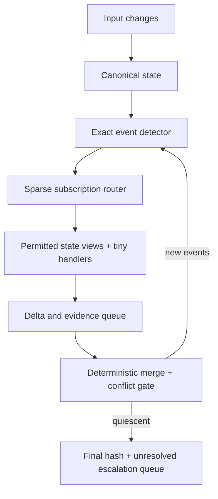

# AXM State Floor

AXM State Floor is a runnable software-runtime experiment for testing whether one canonical deterministic state can support many small perspective nodes without giving every node a private conversational history.

This is not a hardware layer, an AI-agent simulation, or evidence that thousands of unique expert disciplines exist. It contains 16 deterministic perspective families and generates scoped variants to test registration, sparse wake-up, receipts, deterministic merging, conflict preservation, and scaling.

## What it runs



The included object world has geometry, dimensions, material, mass, cost, intended use, provenance, accessibility, energy, components, and constraints. The standard transition changes material and one dimension.

## Run locally

Requirements: Python 3.11 or newer. The experiment uses only the Python standard library.

On Windows, double-click `RUN_EXPERIMENT_WINDOWS.bat`. On Linux or macOS, run `sh run_experiment.sh`. The complete benchmark takes about a minute on the recorded host because the naive 10,000-node comparison deliberately repeats full-packet work.

```bash
cd axm-state-floor
python3 -m unittest discover -s tests -v
python3 -m axm_state_floor.benchmark \
  --output-dir results \
  --scales 10 100 1000 10000 \
  --replay-runs 3
```

The benchmark command writes:

- `results/benchmark_results.json` — raw metrics and comparisons.
- `results/BENCHMARK_RESULTS.md` — readable generated table.
- `results/receipts_<scale>.jsonl` — one raw execution receipt per line.
- `results/pre_hash_cache/` — preserved first-run evidence from before a discovered repeated-hashing bottleneck was repaired.

## Node contract

Each registered node has:

```text
id
perspective
subscriptions
reads
priority_or_domain_authority
deterministic_handler
output_schema
version
```

Each execution receipt has:

```text
node_id
input_state_hash
triggering_event
output_delta
evidence_refs
output_hash
execution_time_ns
changed_state
```

Execution time is measured but excluded from deterministic replay fingerprints.

## Evidence map

- [Architecture notes](ARCHITECTURE.md)
- [Final report](FINAL_REPORT.md)
- [Failures and limitations](FAILURE_LIMITATIONS.md)
- [Next experiment](NEXT_EXPERIMENT.md)
- [Environment probe](ENVIRONMENT_PROBE.md)
- [Generated benchmark summary](results/BENCHMARK_RESULTS.md)
- [Raw benchmark results](results/benchmark_results.json)

## Interpretation rule

The measured ratios describe this Python implementation, host, generated world, and deliberately naive full-packet baseline. They do not prove universal speedups, general AI replacement, hardware-level behavior, or that state is always sufficient memory.
