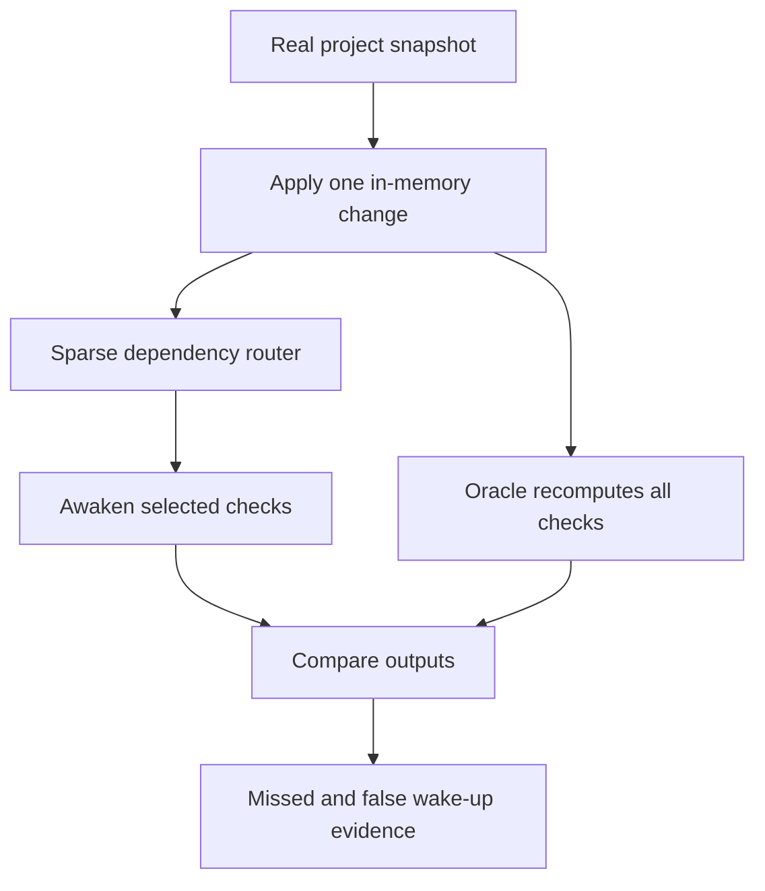

# AXM Workfloor Sentinel

AXM Workfloor Sentinel is the second runnable experiment built on AXM State Floor. It tests whether a sparse dependency router can wake every check whose output should change—without waking every registered check.

The standalone ZIP bundles the verified State Floor v0.1.0 foundation and watches its real source snapshot. In this research repository, the runnable experiment references the canonical sibling `experiments/01-state-floor` source instead of duplicating it. Seven deterministic adversarial changes are applied only in memory; source files are never modified by the trace.

## Core test



The experiment deliberately begins with one incomplete cross-file dependency. The checker reads both `FINAL_REPORT.md` and raw benchmark JSON but initially subscribes only to the report. Changing the JSON leaves that checker asleep, producing one measured miss and a final output mismatch. The repaired registry adds the missing dependency and reruns the same trace.

## Three execution modes

1. **Sparse router:** evaluate only checks subscribed to the changed file/category.
2. **Shared-snapshot oracle:** recompute all checks against one canonical state.
3. **Duplicated-packet baseline:** copy and decode full state/history for every check.

All modes use the same 242 check contracts and evaluators.

## Run it

Requirements: Python 3.11 or newer; no external packages.

On Windows, double-click `RUN_SENTINEL_WINDOWS.bat`. On Linux or macOS:

```bash
sh run_sentinel.sh
```

Or run manually:

```bash
python3 -m unittest discover -s tests -v
python3 -m sentinel.benchmark --output-dir results --replay-runs 3
```

## Evidence map

- `FINAL_REPORT.md` — plain result.
- `ARCHITECTURE.md` — runtime and oracle design.
- `CHECK_CATALOG.md` — what the 242 checks actually are.
- `FAILURE_LIMITATIONS.md` — failed assumptions and claim boundaries.
- `NEXT_EXPERIMENT.md` — strongest next attack.
- `FOUNDATION_RECEIPT.md` — source and freshness chain.
- `results/sentinel_results.json` — raw metrics.
- `results/SENTINEL_RESULTS.md` — generated readable table.
- `results/receipts_dependency_bug.jsonl` — pre-repair receipts.
- `results/receipts_repaired.jsonl` — repaired receipts.

## Claim boundary

The source snapshot is real. The change trace is a controlled adversarial fixture, not an organic Git history. Zero missed wake-ups is established only for this registry and these seven changes.
