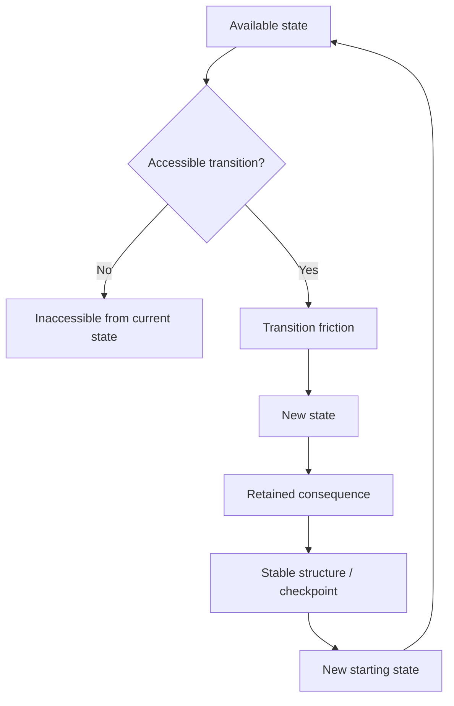
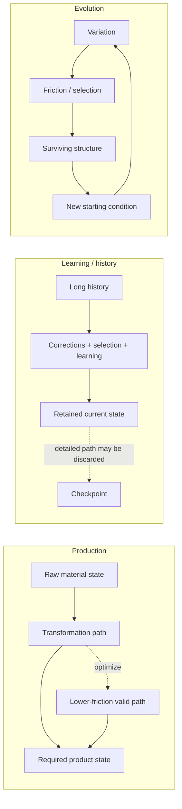
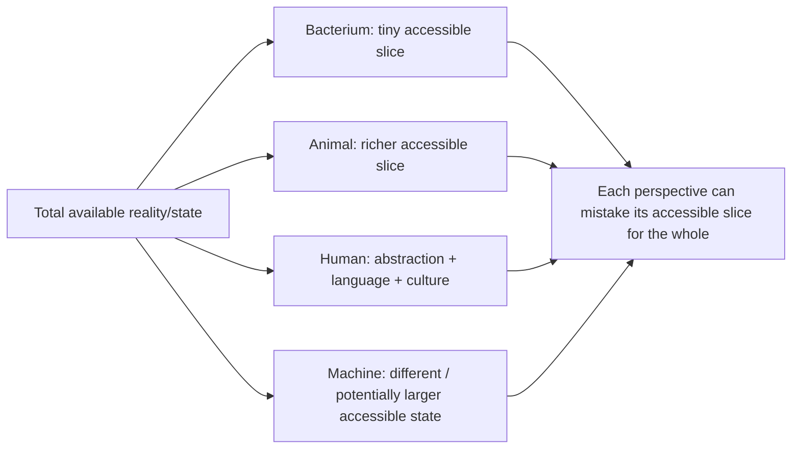
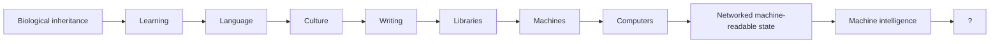
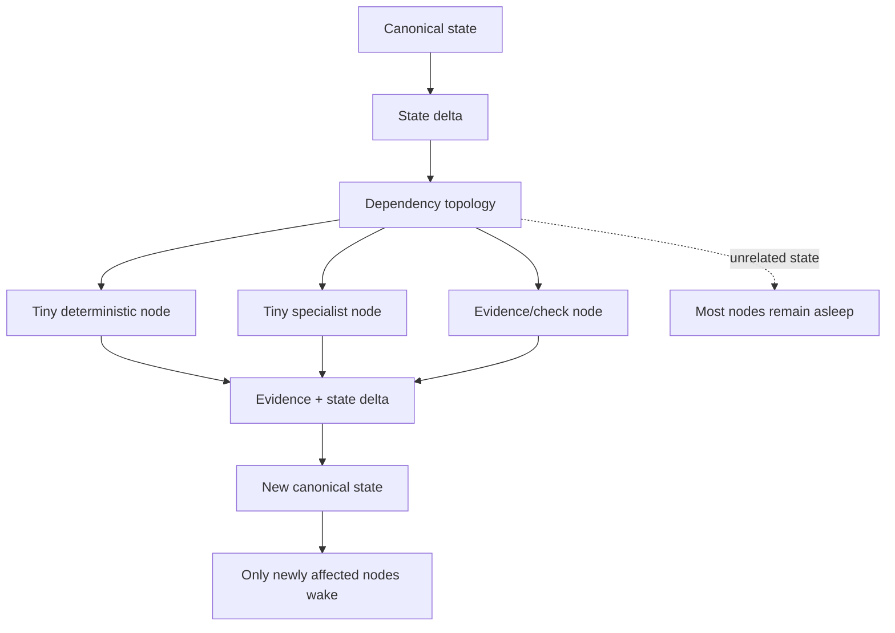
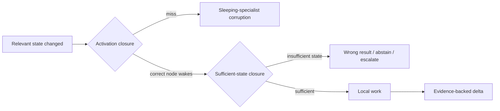

# Visual Log: State -> Friction -> Retained State -> Next Layer

**Date:** 2026-09-02  
**Status:** visual research checkpoint, not canon  
**Boundary:** captures the conversation before the separate matter-transfer branch; that branch is intentionally excluded.



## The same pattern at different scales



## Perspective / context metaphor



`Context window` here is a metaphor for the portion of state a system can perceive, retain, model, and act through. It is not a literal token-window claim about biology.

## Retained-state ladder



The proposed pattern is not that evolution has a destination. Each layer can inherit retained consequences from earlier layers instead of restarting the whole path.

## Machine intelligence timeline lens

```text
Homo sapiens timespan:     ~300,000 years
Formal AI field:           ~70 years (1956 -> 2026)
Timespan ratio:            ~4,286 : 1

Interpretation boundary:
- this is NOT an intelligence-speed multiplier;
- machine systems inherited a huge human/cultural/scientific checkpoint;
- the interesting observation is compressed time + inherited state.
```

## State-level specialist-fabric inversion



### Correctness gates



## Cheapest sufficient mechanism

```text
Deterministic check
    -> bounded algorithm
    -> tiny learned specialist
    -> larger reasoning model
```

The machine should use the cheapest mechanism that satisfies the correctness and evidence gate.

## Compact research map

```text
STATE
  + ACCESSIBILITY
  + FRICTION
  + RETAINED CONSEQUENCES
        |
        v
successful path becomes structure
        |
        v
structure becomes next starting state
        |
        v
new perspective / new reachable transitions
        |
        v
repeat
```

## Falsification boundary

This visual is a map of the hypothesis, not proof. The project should measure:

- missed wake-ups;
- false wake-ups;
- oracle equality;
- dependency-maintenance cost;
- sufficient-state failures;
- total work avoided;
- whether capability can rise while unnecessary computation falls.

If the pattern breaks, log the boundary rather than stretching the story.
